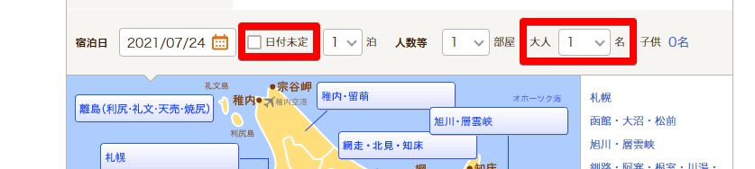

# Ohitorisama



This is a Chrome extension that modifies (+α) the number of people selected by default on accommodation booking sites to one person.
It currently only supports [じゃらん](https://www.jalan.net/).

# Features

- Set the default number of selections to one, and remember the number of selections when the user changes it.
- Uncheck "日付未定" by default.

# Development

```
# clone
$ git clone https://github.com/aoisupersix/ohitorisama.git

# install dependencies
$ npm i

# package files for development
$ npm run watch
```

- Hot reloading using [webpack-chrome-extension-reloader](https://www.npmjs.com/package/webpack-chrome-extension-reloader)
    - WSL is not supported. Because WebSocket cannot be connected from WSL.